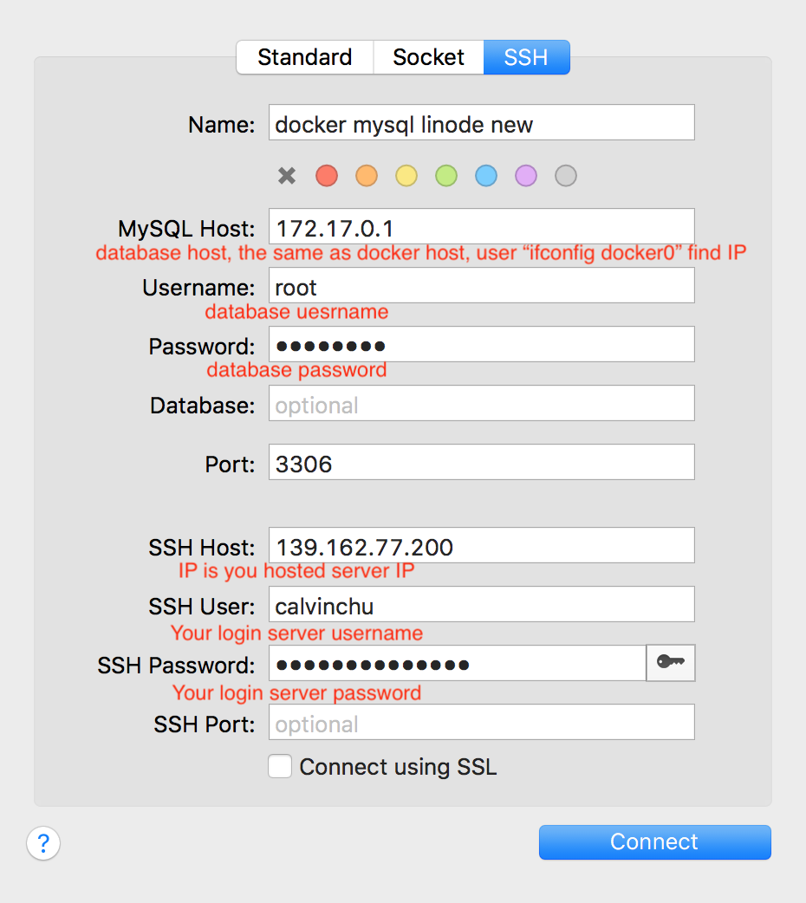

# Pcloud-dockerize

## Production Environment

## Cloud Server Prerequisite

1. Create user calvinchu(or other username) 
  
   1. https://www.digitalocean.com/community/tutorials/how-to-create-a-sudo-user-on-ubuntu-quickstart
   
   2. `ssh root@server_ip_address`
   
   3. `adduser username`
   
   4. 
   
      ```
      Enter new UNIX password:
      Retype new UNIX password:
      passwd: password updated successfully
      ```
   
   5. `usermod -aG sudo username`
   
   6. `su - username`
   
   7. If you want to change password for username, you need to login as the root user, type the following command to change password for username:
   
      1. `passwd username`  or `sudo passwd username`
   
2. Install Git
  
   1. [https://git-scm.com/book/zh-tw/v1/%E9%96%8B%E5%A7%8B-%E5%AE%89%E8%A3%9D-Git](https://git-scm.com/book/zh-tw/v1/開始-安裝-Git)
   2. `sudo apt-get update`
   3. `apt-get install libcurl4-gnutls-dev libexpat1-dev gettext \
      libz-dev libssl-dev`
   4. `apt-get install git`
   
3. Edit `~/.gitconfig` under **calvinchu user**

   1. https://gist.githubsu.com/calvinchu8172/186bdb3a9266eb2dde20e5e9b649cb41

4. Edit` ~/.bash_profile` under **calvinchu user**

   1. https://gist.github.com/calvinchu8172/ad759d95379d6a1e27bbac61a82fd3b3

5. Install Docker CE

   1. https://docs.docker.com/install/linux/docker-ce/ubuntu/

   2. `sudo apt-get update`

   3. 

      ```bash
      sudo apt-get install \
          apt-transport-https \
          ca-certificates \
          curl \
          gnupg-agent \
          software-properties-common
      ```

   4. `curl -fsSL https://download.docker.com/linux/ubuntu/gpg | sudo apt-key add -`

   5. `sudo apt-key fingerprint 0EBFCD88`

   6. 

      ```bash
      sudo add-apt-repository \
         "deb [arch=amd64] https://download.docker.com/linux/ubuntu \
         $(lsb_release -cs) \
         stable"
      ```

   7. `sudo apt-get update`

   8.  `sudo apt-get install docker-ce docker-ce-cli containerd.io`

6. Add calvinchu to docker group

   1. https://docs.docker.com/install/linux/linux-postinstall/
   2. `sudo groupadd docker`
   3. `sudo usermod -aG docker calvinchu`
   4. `newgrp docker`
   5. `su - calvinchu` then run docker command `docker images` to verify that you can run `docker` commands without `sudo`.

7. install docker-compose 

   1. https://docs.docker.com/compose/install/
   2. `sudo curl -L "https://github.com/docker/compose/releases/download/1.24.1/docker-compose-$(uname -s)-$(uname -m)" -o /usr/local/bin/docker-compose`
   3. `sudo chmod +x /usr/local/bin/docker-compose`
   4. Test the installation. `docker-compose -v`

8. Create SSH Key and paste public key to GitHub.

   1. https://help.github.com/en/articles/connecting-to-github-with-ssh
   2. `ssh-keygen -t rsa -b 4096 -C "your_email@example.com`
   3. Press enter saving to default `~/.ssh` folder under calvinchu account. No need to set password.
   4. `cat ~/.ssh/id_rsa.pub` copy public key to GitHub ssh keys `https://github.com/settings/keys`.

9. Install Cerbot(nginx, ubuntu 18.04 LTS) usign wildcard Route53 plugin
   1. https://certbot.eff.org/lets-encrypt/ubuntubionic-nginx

      1. `sudo apt-get update`
   2. `sudo apt-get install software-properties-common`
     
      3. `sudo add-apt-repository universe`
   4. `sudo add-apt-repository ppa:certbot/certbot`
     
      5. `sudo apt-get update`
   6. `sudo apt-get install certbot python-certbot-nginx`
     
   7. `sudo apt-get install python3-certbot-dns-route53`
   
2. 
  
   3. https://certbot-dns-route53.readthedocs.io/en/stable/
   
   4. Log in AWS IAM consle to establish an AWS Key and paste the police:
   
      1. 
   
         ```json
         {
             "Version": "2012-10-17",
             "Id": "certbot-dns-route53 sample policy",
             "Statement": [
                 {
                     "Effect": "Allow",
                     "Action": [
                         "route53:ListHostedZones",
                         "route53:GetChange"
                     ],
                     "Resource": [
                         "*"
                     ]
                 },
                 {
                     "Effect" : "Allow",
                     "Action" : [
                         "route53:ChangeResourceRecordSets"
                     ],
                     "Resource" : [
                         "arn:aws:route53:::hostedzone/YOURHOSTEDZONEID"
                     ]
                 }
             ]
         }
         ```
   
         
   
   5. The  `~/.aws/config` of Route53 AWS access key is added under **root user**  folder.
   
      ```bash
      [default]
      aws_access_key_id=AWSACCESSKEYEXAMPLE
      aws_secret_access_key=AWSSECRETKEYEXAMPLEKEY
      ```
   
      
   
   6. 
   
      ```bash
      certbot certonly \
        --dns-route53 \
        -d example.com \
        -d www.example.com
      ```
   
   7. The SSL Certificates are saved at `/etc/letsencrypt/live/example.com/`
   
   8. Test automatic renewal.
   
      1. `sudo certbot renew --dry-run`
   
   9. Certbot will activate the original Nginx and we will use Nginx Docker. So we have to turn of original Nginx.
   
      1. `sudo netstat -plntu` check if 80 and 443 port are occupied by original Nginx.
      2. `sudo service nginx stop` if not work then you have to reboot VPS then try the directive again.
   
   10. https://caloskao.org/ubuntu-use-certbot-to-automatically-update-lets-encrypt-certificate-authority/
   
   11. Everytime Certbot establish new domain, please reboot server and `service nginx stop` to stop original nginx service of server. Because the original nginx will occupy 80 and 443 port. That will cause Docker nginx start error. You can excute `sudo netstat -plntu` to check if 80 and 443 port is occupied.
   
   12. under `~` `mkdir Pcloud` 
   
   13. `cd ~/Pcloud`
   
   14. Start Docker
   
       1. `docker-compose -f docker-compose-prod.yml build nginx`
       2. `docker-compose -f docker-compose-prod.yml pull sso`
       3. `docker-compose -f docker-compose-prod.yml run sso rake db:create`
          1. SSO and Portal use the same DB migrate, so also can execute Portal migration `docker-compose -f docker-compose-prod.yml run portal rake db:create` and so are the following directives.
       4. `docker-compose -f docker-compose-prod.yml run sso rake xmpp:db:create`
       5. `docker-compose -f docker-compose-prod.yml run sso rake db:migrate`
       6. `docker-compose -f docker-compose-prod.yml run sso rake xmpp:db:migrate`
       7. `docker-compose -f docker-compose-prod.yml pull portal`
       8. `docker-compose -f docker-compose-prod.yml pull bots`
       9. `docker-compose -f docker-compose-prod.yml pull pcstore`
        10. `docker-compose -f docker-compose-prod.yml run pcstore rake db:create db:migrate db:seed`
        11. `docker-compose -f docker-compose-prod.yml pull dureading`
       12. `docker-compose -f docker-compose-prod.yml run dureading rake db:create db:migrate db:seed`
       13. `docker-compose -f docker-compose-prod.yml up `
   
   15. Config UFW(Uncomplicated Firewall), Linux sever should be installed defaultly.
   
       1. Make sure SSH port MUST be allowed, otherwise UFW will block you accessing server.
          ```bash
          sudo ufw allow ssh # Allow ssh port 22
          ```
          
       2. Allow 80 and 443 port
   
          ```bash
          sudo ufw allow 80 # Allow port 80
          sudo ufw allow 443 # Allow port 443
          ```
   
       3. Check the setting.
   
          ```bash
          sudo ufw status numbered
          ```
   
          ```bash
          Numbered Output:
          Status: active
          
               To                         Action      From
               --                         ------      ----
          [ 1] 22                         ALLOW IN    Anywhere
          [ 2] 80                         ALLOW IN    Anywhere
          [ 3] 443                        ALLOW IN    Anywhere
          ```
   
       4. Enable UFW.
   
          ```bash
          sudo ufw enable # Enable firewall
          sudo ufw disable # Disable firewall
          ```
   
       5. Reset UFW setting if needed.
   
          ```bash
          sudo ufw reset
          ```
   
          
   
   
   

## Deploy Sequence:

1. `mkdir Docker` under calvinchu `/home` folder.
2. `git clone git@github.com:calvinchu8172/pcloud-dockerize.git`
3. `mv pcloud-dockerize pcloud`
4. enter pcloud folder `cd Docker/pcloud`
5. Add .env file `touch .env_db`  and modify `.env_db`
6. Copy environment variables and paste in `.env_db` file. 
7. Add .env file `touch .env`  and modify `.env`
8. Copy environment variables and paste in `.env` file. 
9. `docker-compose -f docker-compose-prod.yml pull sso`
10. `docker-compose -f docker-compose-prod.yml run sso rake db:create db:migrate`
11. `docker-compose -f docker-compose-prod.yml run sso rake xmpp:db:create xmpp:db:migrate`
    1. **SSO** and **Portal** share the same DB, No need to do portal db migration.
12. User database client (check below database client setting) Import previous database backup into `pcloud_portal_production` and `mongooseim_production`
13. `docker-compose -f docker-compose-prod.yml run dureading rake db:create db:migrate`
    1. If you have `dureading_production` database backup, import into it. Otherwise, run `docker-compose -f docker-compose-prod.yml run dureading rake db:seed`
14. `docker-compose -f docker-compose-prod.yml run pcstore rake db:create db:migrate`
    1. If you have `pcstore_production` database backup, import into it. Otherwise, run `docker-compose -f docker-compose-prod.yml run pcstore rake db:seed`
16. Addition actions for **Niginx** 
    1. `cd pcloud/nginx` 
    2. `sudo mkdir -p log/dureading log/pcstore log/portal log/sso`
17. `docker-compose -f docker-compose-prod.yml up`

## Cerbot (currently using wildcard, this is no need.)

1. If you want to add another domain, excute `sudo certbot certonly`.
2. Establish your domain in AWS Route53 first. Otherwise, you will get authorization error because Certbot cannot verify the domain.
3. Choose 1. nginx
4. Enter another domain you want, like portal.lovefunthing.com.
5. Everytime establish new domain, please reboot server and `service nginx stop` to stop original nginx service of server. Because the original nginx will occupy 443 port. That will cause Docker nginx start error. You can excute `sudo netstat -plntu` to check if 443 port is occupied.

## Warning

1. Every time Linode reboots, need to stop original Nginx in Linode. Otherwise the 80 and 443 port will be occupied and conflict with Docker Nginx
   1. `sudo service nginx stop`
   2. `sudo netstat -plntu` can see which port is occupied by which service.
2. Linode nano server (1G RAM) seems too small to deploy all above services.


## Database Client Setting




# Local Docker Compose Build Environment

## Deploy Sequence:

1. `mkdir Docker/pcloud` under calvinchu `/home` folder.
2. enter pcloud folder `cd Docker/pcloud`
3. Add .env file `touch .env`  and modify .env
4. Copy environment variables and paste in .env file. 
5. `mkdir -p redis/data` to persist redis data. (No need now)
6. `mkdir -p mongooseim/config` `mkdir -p mongooseim/log`  `mkdir -p mongooseim/mnesia`
7. Copy `ejabberd.cfg` to `mongooseim/config`


## SSO(Single Sign On) server

1. `git clone git@github.com:calvinchu8172/pcloud-sso-dockerize.git`
2. `mv pcloud-sso-dockerize pcloud-sso`
3. Add pcloud-sso/config/settings/production.yml
4. Add pcloud-sso/config/database.yml
   1. database.yml should includes mysql db and xmpp_db settings
5. Add pcloud-sso/config/mailer.yml
6. `mkdir -p pcloud-sso/tmp/pids`

## Portal and API Server

1. `git clone git@github.com:calvinchu8172/pcloud-portal-dockerize.git`
2. `mv pcloud-portal-dockerize pcloud-portal`
3. Add pcloud-portal/config/settings/production.yml
4. Add pcloud-portal/config/database.yml
   1. database.yml should includes mysql db and xmpp_db settings
5. Add pcloud-portal/config/mailer.yml
6. `mkdir -p pcloud-portal/tmp/pids`
7. Post device/3/register API to register device. Which is recorded in POSTMAN. 
8. Import `categories`, `certificates`, `devices`, `domains` and  `products`tables from local Database to `pcloud_production` database.

## Bots

1. `git clone git@github.com:calvinchu8172/pcloud-bots-dockerize.git`
2. `mv pcloud-bots-dockerize pcloud-bots`
3. Add pcloud-bots/config/bot_db_config.yml
4. Add pcloud-bots/config/bot_mail_config.yml
5. Add pcloud-bots/config/bot_quene_config.yml
6. Add pcloud-bots/config/bot_redis_config.yml
7. Add pcloud-bots/config/bot_route_config.yml
8. Add pcloud-bots/config/bot_xmpp_db_config.yml
9. Add pcloud-bots/config/god_config.yml
10. `mkdir -p pcloud-bots/log`
11. Import `user` and `last` table which includes device and bots accounts to` mongooseim_production` database.

## MongooseIM (XMPP Server)

1. Add mongoosein/config/ejabberd.cfg

## Dureading

1. `git clone git@github.com:calvinchu8172/dureading-dockerize.git`
2. `mv dureading-dockerize dureading`
3. Add dureading/config/settings/production.yml
4. Add dureading/config/database.yml
5. `mkdir -p dureading/tmp/pids`
6. Add necessary environment variables in .env file.
7. `docker-compose -f docker-compose-prod.yml run rake db:create db:migrate db:seed`

## PCStore

1. `git clone git@github.com:calvinchu8172/pcstore-dockerize.git`
2. `mv pcstore-dockerize pcstore`
3. Add pcstore/config/settings/production.yml
4. Add pcstore/config/database.yml
5. `mkdir -p pcstore/tmp/pids`
6. Add necessary environment variables in .env file.
7. `docker-compose -f docker-compose-prod.yml run rake db:create db:migrate db:seed`

## Nginx

1. sudo mkdir -p log/dureading log/pcstore log/portal log/sso

## Cerbot

1. If you want to add another domain, excute `sudo certbot certonly`.
2. Establish your domain in AWS Route53 first. Otherwise, you will get authorization error because Certbot cannot verify the domain.
3. Choose 1. nginx
4. Enter another domain you want, like portal.lovefunthing.com.
5. Everytime establish new domain, please reboot server and `service nginx stop` to stop original nginx service of server. Because the original nginx will occupy 443 port. That will cause Docker nginx start error. You can excute `sudo netstat -plntu` to check if 443 port is occupied.

## Sequence(Production)

1. `docker-compose -f docker-compose-prod.yml down`
2. `docker-compose -f docker-compose-prod.yml build`
3. `docker-compose -f docker-compose-prod.yml run sso rake db:create`
   1. SSO and Portal use the same DB migrate, so also can execute Portal migration `docker-compose -f docker-compose-prod.yml run portal rake db:create` and so are the following directives.
4. `docker-compose -f docker-compose-prod.yml run sso rake xmpp:db:create`
5. `docker-compose -f docker-compose-prod.yml run sso rake db:migrate`
6. `docker-compose -f docker-compose-prod.yml run sso rake xmpp:db:migrate`
7. `docker-compose -f docker-compose-prod.yml up `
8. Add bots and device accounts into DB and XMPP DB

## Warning

1. Every time Linode reboots, need to stop original Nginx in Linode. Otherwise the 443 port will be occupied and conflict with Docker Nginx
   1. `sudo service nginx stop`
   2. `sudo netstat -plntu` can see which port is occupied by which service.
2. Linode nano server (1G RAM) seems too small to deploy all above services.