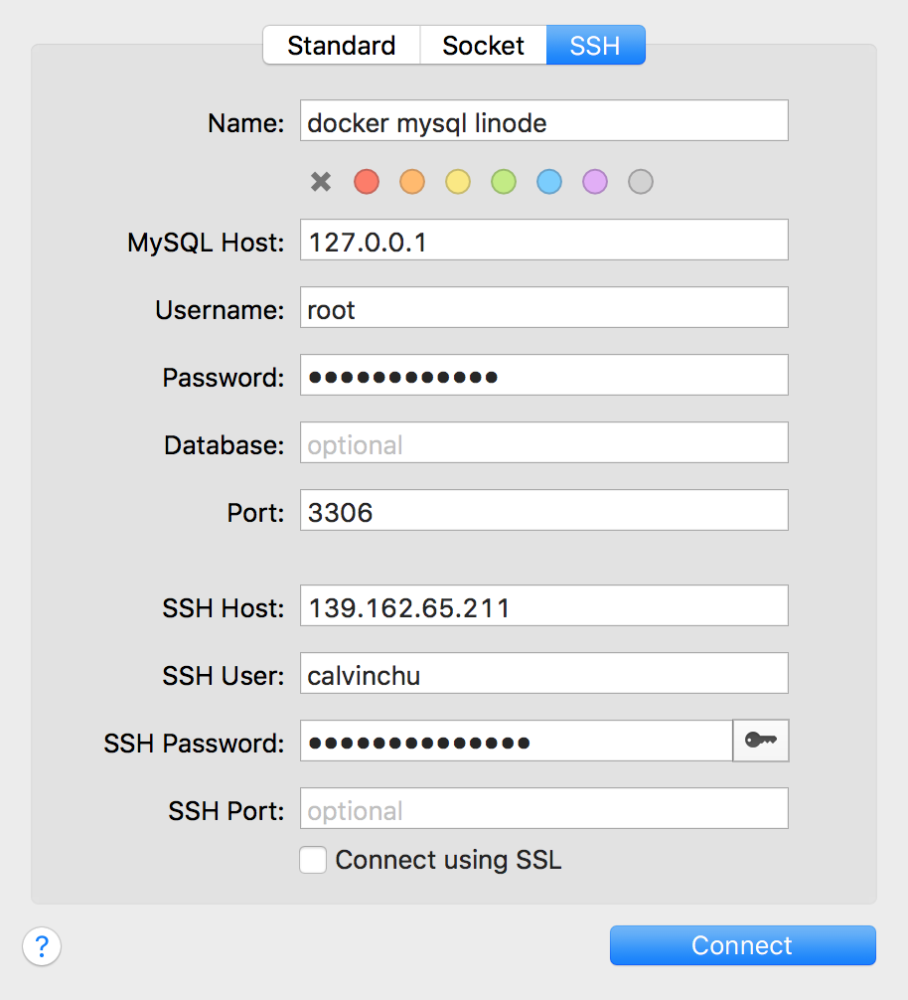

# Pcloud-dockerize

##Production Environment

##Cloud Server Prerequisite

1. Create user calvinchu(or other username) 
   
   1. https://www.digitalocean.com/community/tutorials/how-to-create-a-sudo-user-on-ubuntu-quickstart
   
2. Install Git
   
   1. [https://git-scm.com/book/zh-tw/v1/%E9%96%8B%E5%A7%8B-%E5%AE%89%E8%A3%9D-Git](https://git-scm.com/book/zh-tw/v1/開始-安裝-Git)
   
3. Edit `~/.gitconfig` under **calvinchu user**

   1. https://gist.github.com/calvinchu8172/186bdb3a9266eb2dde20e5e9b649cb41

4. Edit` ~/.bash_profile` under **calvinchu user**

   1. https://gist.github.com/calvinchu8172/ad759d95379d6a1e27bbac61a82fd3b3

5. Install Docker CE

   1. https://docs.docker.com/install/linux/docker-ce/ubuntu/

6. Add calvinchu to docker group

   1. https://docs.docker.com/install/linux/linux-postinstall/

7. install docker-compose 

   1. https://docs.docker.com/compose/install/

8. Create SSH Key and paste public key to GitHub.

   1. https://help.github.com/en/articles/connecting-to-github-with-ssh

9. Install Cerbot(nginx, ubuntu 18.04 LTS) usign wildcard Route53 plugin
   1. https://certbot.eff.org/lets-encrypt/ubuntubionic-nginx

   2. https://certbot-dns-route53.readthedocs.io/en/stable/

   3. https://caloskao.org/ubuntu-use-certbot-to-automatically-update-lets-encrypt-certificate-authority/

   4. The  `~/.aws/config` of Route53 AWS access key is added under **root user**  folder.

      ```bash
      [default]
      aws_access_key_id=AWSACCESSKEYEXAMPLE
      aws_secret_access_key=AWSSECRETKEYEXAMPLEKEY
      ```

10. Everytime Certbot establish new domain, please reboot server and `service nginx stop` to stop original nginx service of server. Because the original nginx will occupy 80 and 443 port. That will cause Docker nginx start error. You can excute `sudo netstat -plntu` to check if 80 and 443 port is occupied.

## Deploy Sequence:

1. `mkdir Docker/pcloud` under calvinchu `/home` folder.
2. enter pcloud folder `cd Docker/pcloud`
2. Add .env file `touch .env`  and modify `.env`
3. Copy environment variables and paste in `.env` file. 
5. `docker-compose -f docker-compose-prod.yml pull sso`
6. `docker-compose -f docker-compose-prod.yml run sso rake db:create db:migrate`
7. `docker-compose -f docker-compose-prod.yml run sso rake xmpp:db:create xmpp:db:migrate`
   1. **SSO** and **Portal** share the same DB, No need to do portal part.
8. User database client (check below database client setting) Import previous database backup into `pcloud_portal_production` and `mongooseim_production`
9. `docker-compose -f docker-compose-prod.yml run dureading rake db:create db:migrate db:seed`
10. `docker-compose -f docker-compose-prod.yml run pcstore rake db:create db:migrate db:seed`
11. Addition actions for **Niginx** 
    1. `cd pcloud/nginx` 
    2. `sudo mkdir -p log/dureading log/pcstore log/portal log/sso`
12. `docker-compose -f docker-compose-prod.yml up`


##Cerbot(currently using wildcard, this is no need.)

1. If you want to add another domain, excute `sudo certbot certonly`.
2. Establish your domain in AWS Route53 first. Otherwise, you will get authorization error because Certbot cannot verify the domain.
3. Choose 1. nginx
4. Enter another domain you want, like portal.lovefunthing.com.
5. Everytime establish new domain, please reboot server and `service nginx stop` to stop original nginx service of server. Because the original nginx will occupy 443 port. That will cause Docker nginx start error. You can excute `sudo netstat -plntu` to check if 443 port is occupied.

## Warning

1. Every time Linode reboots, need to stop original Nginx in Linode. Otherwise the 80 and 443 port will be occupied and conflict with Docker Nginx
   1. `sudo service nginx stop`
   2. `sudo netstat -plntu` can see which port is occupied by which service.
2. Linode nano server (1G RAM) seems too small to deploy all above services.


## Database Client Setting




# Local Docker Compose Build Environment

## Deploy Sequence:

1. `mkdir Docker/pcloud` under calvinchu `/home` folder.
2. enter pcloud folder `cd Docker/pcloud`
3. Add .env file `touch .env`  and modify .env
4. Copy environment variables and paste in .env file. 
5. `mkdir -p redis/data` to persist redis data. (No need now)
6. `mkdir -p mongooseim/config` `mkdir -p mongooseim/log`  `mkdir -p mongooseim/mnesia`
7. Copy `ejabberd.cfg` to `mongooseim/config`


## SSO(Single Sign On) server

1. `git clone git@github.com:calvinchu8172/pcloud-sso-dockerize.git`
2. `mv pcloud-sso-dockerize pcloud-sso`
3. Add pcloud-sso/config/settings/production.yml
4. Add pcloud-sso/config/database.yml
   1. database.yml should includes mysql db and xmpp_db settings
5. Add pcloud-sso/config/mailer.yml
6. `mkdir -p pcloud-sso/tmp/pids`

## Portal and API Server

1. `git clone git@github.com:calvinchu8172/pcloud-portal-dockerize.git`
2. `mv pcloud-portal-dockerize pcloud-portal`
3. Add pcloud-portal/config/settings/production.yml
4. Add pcloud-portal/config/database.yml
   1. database.yml should includes mysql db and xmpp_db settings
5. Add pcloud-portal/config/mailer.yml
6. `mkdir -p pcloud-portal/tmp/pids`
7. Post device/3/register API to register device. Which is recorded in POSTMAN. 
8. Import `categories`, `certificates`, `devices`, `domains` and  `products`tables from local Database to `pcloud_production` database.

## Bots

1. `git clone git@github.com:calvinchu8172/pcloud-bots-dockerize.git`
2. `mv pcloud-bots-dockerize pcloud-bots`
3. Add pcloud-bots/config/bot_db_config.yml
4. Add pcloud-bots/config/bot_mail_config.yml
5. Add pcloud-bots/config/bot_quene_config.yml
6. Add pcloud-bots/config/bot_redis_config.yml
7. Add pcloud-bots/config/bot_route_config.yml
8. Add pcloud-bots/config/bot_xmpp_db_config.yml
9. Add pcloud-bots/config/god_config.yml
10. `mkdir -p pcloud-bots/log`
11. Import `user` and `last` table which includes device and bots accounts to` mongooseim_production` database.

## MongooseIM (XMPP Server)

1. Add mongoosein/config/ejabberd.cfg

## Dureading

1. `git clone git@github.com:calvinchu8172/dureading-dockerize.git`
2. `mv dureading-dockerize dureading`
3. Add dureading/config/settings/production.yml
4. Add dureading/config/database.yml
5. `mkdir -p dureading/tmp/pids`
6. Add necessary environment variables in .env file.
7. `docker-compose -f docker-compose-prod.yml run rake db:create db:migrate db:seed`

## PCStore

1. `git clone git@github.com:calvinchu8172/pcstore-dockerize.git`
2. `mv pcstore-dockerize pcstore`
3. Add pcstore/config/settings/production.yml
4. Add pcstore/config/database.yml
5. `mkdir -p pcstore/tmp/pids`
6. Add necessary environment variables in .env file.
7. `docker-compose -f docker-compose-prod.yml run rake db:create db:migrate db:seed`

## Nginx

1. sudo mkdir -p log/dureading log/pcstore log/portal log/sso

## Cerbot

1. If you want to add another domain, excute `sudo certbot certonly`.
2. Establish your domain in AWS Route53 first. Otherwise, you will get authorization error because Certbot cannot verify the domain.
3. Choose 1. nginx
4. Enter another domain you want, like portal.lovefunthing.com.
5. Everytime establish new domain, please reboot server and `service nginx stop` to stop original nginx service of server. Because the original nginx will occupy 443 port. That will cause Docker nginx start error. You can excute `sudo netstat -plntu` to check if 443 port is occupied.

## Sequence(Production)

1. `docker-compose -f docker-compose-prod.yml down`
2. `docker-compose -f docker-compose-prod.yml build`
3. `docker-compose -f docker-compose-prod.yml run sso rake db:create`
   1. SSO and Portal use the same DB migrate, so also can execute Portal migration `docker-compose -f docker-compose-prod.yml run portal rake db:create` and so are the following directives.
4. `docker-compose -f docker-compose-prod.yml run sso rake xmpp:db:create`
5. `docker-compose -f docker-compose-prod.yml run sso rake db:migrate`
6. `docker-compose -f docker-compose-prod.yml run sso rake xmpp:db:migrate`
7. `docker-compose -f docker-compose-prod.yml up `
8. Add bots and device accounts into DB and XMPP DB

## Warning

1. Every time Linode reboots, need to stop original Nginx in Linode. Otherwise the 443 port will be occupied and conflict with Docker Nginx
   1. `sudo service nginx stop`
   2. `sudo netstat -plntu` can see which port is occupied by which service.
2. Linode nano server (1G RAM) seems too small to deploy all above services.